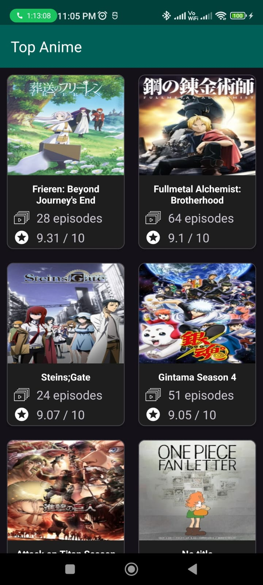
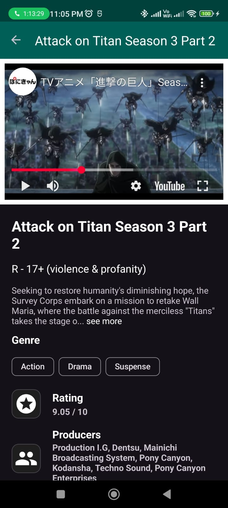

# Parithi Anime
An assignment for a job at Seekho

# Anime Listing App

This is an Android application that showcases a list of top anime fetched from the [Jikan API](https://jikan.moe/). It displays popular anime, their details, and allows users to watch trailers using YouTube embedded videos.

---

## 📥 Download APK

You can try out the app by downloading the latest APK from the link below:

👉 [Download APK from Google Drive](https://drive.google.com/file/d/1l5M7lWLpbQX1IYMlzyqfr9HlYZpqNA74/view?usp=sharing)

---

## 🚀 Features Implemented

- **Anime List**  
  - Displays top 25 popular anime using the Jikan API.
  - Pull-to-refresh support.
  - Automatically call api when user comes online and list is empty.
  
- **Anime Details Screen**  
  - Displays information like title, synopsis, rating, score, genre and producer names.
  - Loads anime cover image using Picasso.
  - Embedded YouTube trailers using WebView.

- **Room DB**
  - Offline support.
  - List persists using Room local database.

- **Dependency Injection with Hilt**  
  - Hilt is used for clean DI setup throughout the app.

- **Navigation Component**  
  - Seamless navigation between screens using Navigation Component.

- **Splash Screen**  
  - Modern splash screen for better UX during app startup.

---

## 🧠 Assumptions Made

- The app only displays the top 25 anime for simplicity and performance.
- Anime details include **producer information** instead of cast.
- Trailers are hosted on YouTube, and the video is embedded using WebView (instead of the full YouTube SDK).
- Error handling is basic (e.g., no connection = toast).

---

## 🛠️ Tech Stack

- **Retrofit & OkHttp** – API requests and networking.
- **Room DB** – Local database.
- **Hilt** – Dependency injection.
- **Picasso** – Image loading.
- **WebView** – Embedding YouTube trailers.
- **Navigation Component** – App navigation.
- **Splash Screen API** – Android 12+ splash experience.

---

## ❗ Known Limitations

- No pagination for anime list (only top 25 displayed).
- No filtering/sorting of anime list yet.

---

## 📸 Screenshots

### 🔹 Home Screen

### 🔹 Anime Details

---

## 📦 Installation

1. Clone the repository.
2. Open in Android Studio.
3. Build and run on emulator or device (API 24+ recommended).

---
